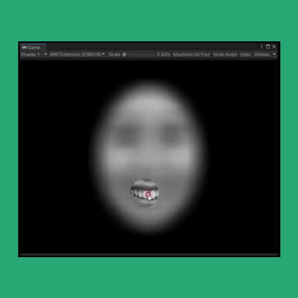

<h1>Moving Window Technique (2021)</h1>

해당 페이지에서 Moving Window Technique 프로젝트의 실험 프로그램을 소개합니다.

<h2>Tech Stack</h2>
<ul>
  <li>Programming Language</li>
  <ul>
    <li></li>
    <li></li>
  </ul>
  <li>Toolkit</li>
  <ul>
    <li></li>
  </ul>
</ul>

<h2>Summary</h2>

사람의 감정인식 전략에 대해 연구하기 위한 실험 프로그램입니다. Birmingham et al. (2013)에서 제안된 Moving Window Technique를 이용하여, 두 번의 실험을 이행할 수 있도록 구현되었습니다.

첫 번째 실험에서는 Moving Window Technique 방법이 감정 인식에 어떠한 전략을 사용토록 하는지 확인합니다. 두 번째 실험에서는 노이즈로 커버된 점화자극을 제시하여, Moving Window Technique 방법이 어떤 전략으로 사용되는지 확인합니다.

모든 자극 세트의 파일 명에는 자극의 성별, 정서, ROI 등이 명시되어 있습니다. 이를 이용해, Raw Data 파일에 각각의 정보가 실시간으로 파싱되어 기록됩니다.

<h2>Detail</h2>

석사과정에서 마지막으로 외부와 수행한 프로젝트입니다. 이 프로젝트는 덕성여대 심리학과 연구실과 함께 수행하였습니다. Moving Window를 재현하기 위해, Unity Standard Shader로 40px by 40px 크기의 필터 크기를 만들고, 그 외 영역을 Gaussian Blur 처리 하였습니다. 또한, 마우스로 Moving Window를 움직일 수 있도록, 마우스의 카메라 프로젝션 좌표를 받아와, Moving Window 필터의 x, y 위치를 실시간으로 조정하였습니다. 물론, 새로운 Moving Window Task를 진행할 때 마다, MouseLockState를 Freeze와 Melt를 반복하여서 좌표를 (0,0)으로 초기화하였습니다.

<h3>실험 1 (Moving Window Task)</h3>

<ol>
  <li>실험자는 기본적인 실험 정보를 기입하고, 피험자를 대기시킵니다.</li>
  <li>피험자는 Fixation Point를 응시하며, 준비가 되었으면 시작버튼을 누릅니다.</li>
  <li>피험자는 단시간 (2500ms) 동안, Moving Window Task를 이행합니다.</li>
  <li>Task 직후, 정서에 가까운 정서 카테고리를 선택하여 응답합니다.</li>
  <li>반복...</li>
</ol>

<h3>실험 2 (Moving Window Task with Priming)</h3>

<ol>
  <li>실험자는 기본적인 실험 정보를 기입하고, 피험자를 대기시킵니다.</li>
  <li>피험자는 Fixation Point를 응시하며, 준비가 되었으면 시작버튼을 누릅니다.</li>
  <li>피험자는 500ms 동안 노이즈를 경험합니다.</li>
  <li>피험자는 1000ms 동안 점화 자극을 경험합니다.</li>
  <li>피험자는 500ms 동안 노이즈를 경험합니다.</li>
  <li>피험자는 단시간 (2500ms) 동안, Moving Window Task를 이행합니다.</li>
  <li>Task 직후, Moving Winodw Task의 정서가 Positive인지 Nagative인지 선택하여 응답합니다.</li>
  <li>반복...</li>
</ol>

<h2>Behind Story</h2>

사실 20년 12월 즈음에 사전 연락이 먼저 왔어야 했습니다 (덕성여대 측으로 부터). 물론, 교수님께서 먼저 상황을 일러주셔서 프로토타입은 완성하고 연구실에서 뛰쳐나왔습니다. 

사전에 구현된 프로그램이 있었는데 (물론, 해당 프로그램은 Window를 마우스가 아닌, Eye-tracking으로 Control하는 방법론이었습니다), Vizard라는 Python VR Framework로 구현된 것이었습니다. 물론, 연구실에 입학하기 직전에 잠깐 배운적이 있어서, 개발을 시도해보았지만, 아무래도 모니터나 기타 컴퓨터 환경이 달라서 인터페이스가 깨지는 현상이 나타났습니다. 또한, ROI 역시 극한의 하드코딩으로 정의되어 있었습니다. 향후, 제가 졸업하고 뒷일을 떠맡을 후배 석사생에게 그대로 인계하는 것이 꺼림직하거니와, 덕성여대 연구원분도 고생하실까 염려되어, 빠르게 플랫폼을 Unity로 옮겼던 기억이 납니다.

<h2>Check This!</h2>
<a href="https://drive.google.com/file/d/1aPv9CSZnU0zMfoBhyXdywXymieaN2Kxh/view?usp=sharing">Moving Window Technique 프로그램 안내서</a>

<h2>프로젝트 영상</h2>

